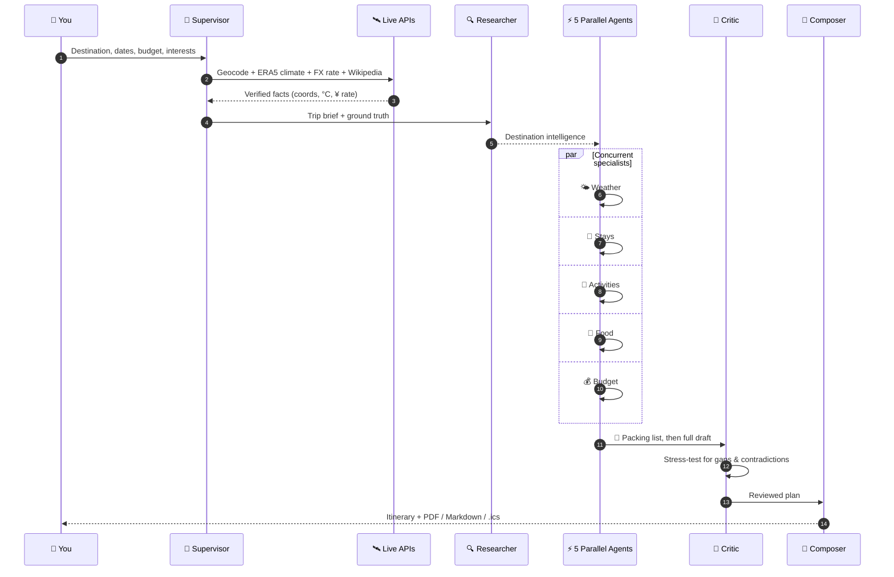
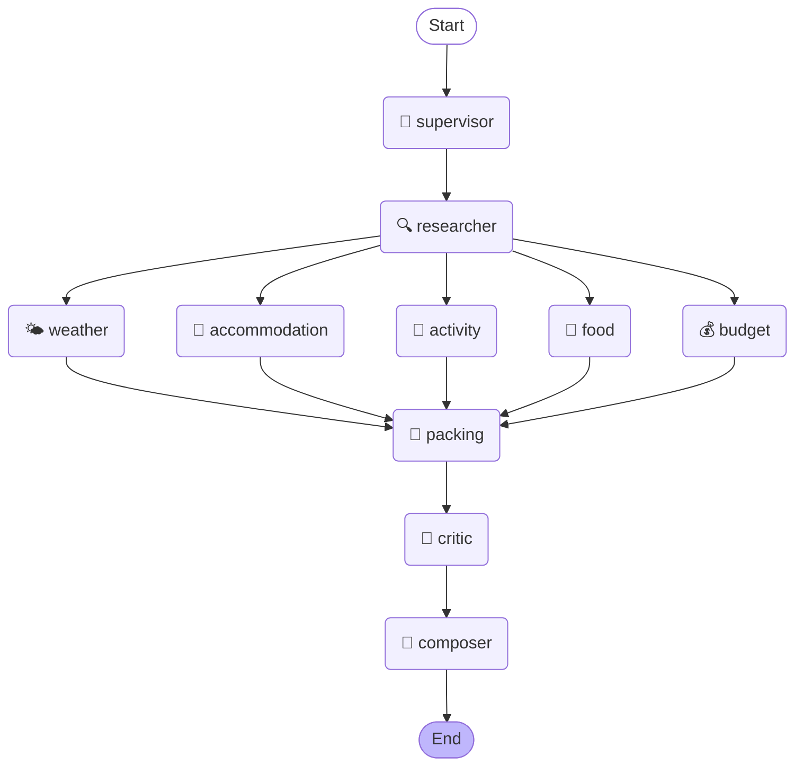
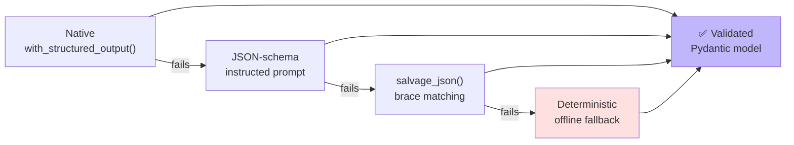

<div align="center">

# 🌍 AI Travel Planner

### A multi-agent travel planning system grounded in real-world data

*Ten specialist AI agents collaborate over a LangGraph state machine to turn one sentence into a complete, fact-checked, exportable trip.*

[](https://www.python.org/)
[](https://langchain-ai.github.io/langgraph/)
[](https://streamlit.io/)
[](https://docs.pydantic.dev/)
[](https://www.docker.com/)

[](#-testing)
[](https://docs.astral.sh/ruff/)
[](#-license)
[](#-choose-your-brain)
[](#-choose-your-brain)

**[Quick Start](#-quick-start) · [How It Works](#-how-it-works) · [Live Data](#-grounded-in-reality) · [Providers](#-choose-your-brain) · [Architecture](#-architecture) · [FAQ](#-faq)**

</div>

---

## 💡 The Problem

Ask any chatbot to plan a trip and it will confidently tell you that Reykjavík is pleasant in January, invent a hotel that closed in 2019, and quote an exchange rate from its training cutoff.

**This project fixes that.** Before a single token is generated, it fetches the *actual* coordinates, the *measured* climate record, and *today's* exchange rate — then instructs every agent to treat those numbers as ground truth.

<table>
<tr>
<th width="50%">❌ A single LLM prompt</th>
<th width="50%">✅ This project</th>
</tr>
<tr>
<td>

- Hallucinated weather and prices
- One giant prompt, one shot
- Free-text output you must re-parse
- Breaks when the model returns prose
- Locked to one vendor

</td>
<td>

- **ERA5 satellite reanalysis** climate data
- **10 specialist agents**, 5 running in parallel
- **Pydantic-validated** structured output
- **3-tier** parsing fallback, never crashes
- **6 providers**, hot-swappable in the UI

</td>
</tr>
</table>

---

## ✨ Highlights

<table>
<tr>
<td width="33%" valign="top">

### 🤖 Ten Agents
A supervisor, five parallel specialists, a packing optimiser, and a **critic that reviews the plan before you see it**.

</td>
<td width="33%" valign="top">

### 🛰️ Real Data
Coordinates, 2 years of daily ERA5 climate observations, live ECB exchange rates, and Wikipedia context.

</td>
<td width="33%" valign="top">

### 🔌 Six Providers
Ollama, Groq, Google, OpenAI, Anthropic, OpenRouter — with **automatic failover** between them.

</td>
</tr>
<tr>
<td valign="top">

### 📐 Typed Contracts
Every agent speaks Pydantic. No regex, no `json.loads` roulette, no `KeyError` at render time.

</td>
<td valign="top">

### 📤 Four Exports
Styled **PDF**, **Markdown**, plain **text**, and a **`.ics` calendar** you can import into any calendar app.

</td>
<td valign="top">

### 🛡️ Never Crashes
Every agent has a deterministic offline fallback. Lose your network mid-run and you still get a plan.

</td>
</tr>
</table>

---

## 🚀 Quick Start

<details open>
<summary><b>🏠 Option A — 100% local &amp; free (Ollama)</b> · <i>no API key, nothing leaves your machine</i></summary>

<br>

```bash
# 1. Install Ollama from https://ollama.com, then pull a model
ollama pull llama3.2

# 2. Set up the project
git clone https://github.com/haarikaalla/AI-Travel-Planner.git
cd AI-Travel-Planner
python -m venv .venv

# Windows
.venv\Scripts\activate
# macOS / Linux
source .venv/bin/activate

pip install -r requirements.txt

# 3. Go
streamlit run app.py
```

Open <http://localhost:8501>. **No configuration required** — the app auto-detects your running Ollama instance.

</details>

<details>
<summary><b>⚡ Option B — fastest inference (Groq free tier)</b> · <i>plans a full trip in seconds</i></summary>

<br>

```bash
cp .env.example .env
```

Add your free key from [console.groq.com](https://console.groq.com/keys):

```env
GROQ_API_KEY=gsk_your_key_here
LLM_PROVIDER=groq
```

```bash
pip install -r requirements.txt
streamlit run app.py
```

The sidebar will now list **Groq** as a configured provider. Any provider you add a key for appears automatically.

</details>

<details>
<summary><b>🐳 Option C — Docker (app + Ollama in one command)</b></summary>

<br>

```bash
docker compose up
```

This starts the planner on <http://localhost:8501> **and** an Ollama sidecar, wired together on a private network. Pull a model into the sidecar once:

```bash
docker compose exec ollama ollama pull llama3.2
```

App only, using a provider key from your `.env`:

```bash
docker build -t ai-travel-planner .
docker run -p 8501:8501 --env-file .env ai-travel-planner
```

> The image is multi-stage and runs as a **non-root user (uid 10001)** with a built-in healthcheck.

</details>

---

## 🔄 How It Works

You type **“Kyoto, Japan · 5 days · mid-range · food + culture”**. Here is what actually happens:



### The agent graph

This diagram is generated **from the live graph object** — it cannot drift from the code.



> **Why the fan-out matters:** weather, stays, activities, food and budget have no dependency on one another, so LangGraph runs them **concurrently**. The wall-clock cost of five agents is roughly the cost of the slowest one.

<details>
<summary><b>👥 Meet the ten agents</b></summary>

<br>

| # | Agent | Role | Notable behaviour |
|:-:|-------|------|-------------------|
| 1 | 🧭 **Supervisor** | Validating request & fetching live data | Fetches all real-world grounding **before** any LLM call |
| 2 | 🔍 **Researcher** | Gathering destination intelligence | Builds the shared brief every downstream agent reads |
| 3 | 🌤 **Weather** | Reading measured climate normals | **Overwrites** the LLM's guesses with measured ERA5 values |
| 4 | 🏨 **Accommodation** | Shortlisting stays by budget | Returns three tiers, each with honest **cons** |
| 5 | 🎯 **Activities** | Designing the day-by-day route | Respects a pacing preference; renumbers days 1…N |
| 6 | 🍜 **Food Guide** | Curating dishes and restaurants | Dishes, restaurants and markets, filtered by diet |
| 7 | 💰 **Budget** | Costing the trip | Uses the **live** exchange rate, not a remembered one |
| 8 | 🧳 **Packing** | Optimising the packing list | Outerwear reacts to the real rainfall figures |
| 9 | 🧠 **Critic** | Stress-testing the plan | A reflection pass that flags gaps and contradictions |
| 10 | 📄 **Composer** | Assembling the final document | Emits the single `TravelPlan` the UI and exporters consume |

</details>

---

## 🛰️ Grounded in Reality

Five sources are queried before generation. **None of them require an API key.**

| Source | What it provides | Why it matters |
|--------|------------------|----------------|
| 🗺️ **Open-Meteo Geocoding** | Coordinates, country, timezone, population | Puts a real pin on the map |
| 🌡️ **Open-Meteo ERA5 Archive** | 2 years of daily observations → 12 monthly normals | Actual measured climate, not a vibe |
| 💱 **Frankfurter (ECB)** | Live USD → local currency rate | Budgets in money that exists today |
| 📖 **Wikipedia REST** | Encyclopaedic destination summary | Factual anchor for the researcher |
| 🌐 **Built-in ISO 3166/4217** | Currency, language, driving side | Works fully offline, zero latency |

<details>
<summary><b>🔬 See the ground-truth block injected into every prompt</b></summary>

<br>

Real output for `Kyoto, Japan`:

```text
VERIFIED REAL-WORLD DATA — treat these as ground truth and never contradict them:
- Location: Kyoto, Japan (35.021, 135.754), timezone Asia/Tokyo
- Population: 1,463,723
- Currency: Japanese yen (JPY ¥)
- Languages: Japanese
- Drives on the left
- Exchange rate: 1 USD = 159.73 JPY (2026-08-31)
- Measured climate normals (Open-Meteo ERA5 reanalysis): annual average high 21.0°C,
  low 12.0°C. Most comfortable months: October, May, June.
  Wettest: June. Driest: January.
- Monthly detail: Jan -0.6-8.0°C/2d rain, Feb 0.0-9.2°C/8d rain, Mar 4.3-13.6°C/13d rain,
  Apr 9.5-19.4°C/10d rain, May 14.6-24.5°C/12d rain, Jun 19.0-27.5°C/14d rain,
  Jul 24.6-34.2°C/13d rain, Aug 25.0-34.4°C/15d rain, Sep 22.4-30.1°C/13d rain, …
```

Try it yourself:

```bash
python -c "from travel_planner.tools import gather_context, context_to_prompt; print(context_to_prompt(gather_context('Reykjavik, Iceland')))"
```

</details>

<details>
<summary><b>🛡️ Security: how destination input is prevented from steering requests</b></summary>

<br>

A destination is user input that ends up in a URL, which is a textbook **SSRF** vector. Defences in [travel_planner/tools.py](travel_planner/tools.py):

- **Hard host allowlist** — requests to any other host are refused before a socket opens
- **Manual redirect handling** — `follow_redirects=False`, with **every hop re-validated** against the allowlist
- **Bounded redirects** — capped at 3
- **Size cap** — responses over 2 MB are discarded
- **URL encoding** — all user input passed through `quote(..., safe='')`
- **Time-boxed** — every call has a timeout
- **Fail-soft** — any failure returns `None`; it never raises into the pipeline

```python
def test_requests_to_unlisted_hosts_are_blocked(monkeypatch):
    """A destination name must never be able to steer an outbound request."""
    monkeypatch.setattr(tools.httpx, "Client", tripwire)
    assert tools._get_json("http://169.254.169.254/latest/meta-data/") is None
    assert tools._get_json("https://evil.example.com/steal") is None
```

Secrets are held as Pydantic `SecretStr`, so a stray log or traceback prints `**********`.

</details>

---

## 🧠 Choose Your Brain

Add a key and the provider appears in the sidebar automatically. Add none and everything still runs on Ollama.

| Provider | Cost | Speed | Env var | Best for |
|----------|------|-------|---------|----------|
| 🦙 **Ollama** | Free | ⚡⚡ | *none* | Privacy, offline, zero cost |
| ⚡ **Groq** | Free tier | ⚡⚡⚡⚡⚡ | `GROQ_API_KEY` | Blazing fast iteration |
| 🔷 **Google Gemini** | Free tier | ⚡⚡⚡⚡ | `GOOGLE_API_KEY` | Long context, generous limits |
| 🟢 **OpenAI** | Paid | ⚡⚡⚡ | `OPENAI_API_KEY` | Best structured-output support |
| 🟣 **Anthropic** | Paid | ⚡⚡⚡ | `ANTHROPIC_API_KEY` | Strongest long-form reasoning |
| 🌐 **OpenRouter** | Mixed | ⚡⚡⚡ | `OPENROUTER_API_KEY` | One key, hundreds of models |

<details>
<summary><b>🔁 Structured output: the three-tier strategy</b></summary>

<br>

Local models frequently ignore JSON instructions and wrap output in prose. Rather than accept that, [travel_planner/llm.py](travel_planner/llm.py) escalates:



`salvage_json()` is **string-literal aware** — it tracks quotes and escapes while balancing braces, so a `}` inside `"Café Français }"` doesn't truncate the object. Tier 4 guarantees the user *always* receives a usable plan.

Cross-provider failover is configurable: if the primary provider errors, `fallback_chain()` tries the next configured one.

</details>

---

## 🏗️ Architecture

```
AI-Travel-Planner/
├── app.py                       # Streamlit UI — 8 tabs, real-time agent tracker
├── travel_planner/
│   ├── config.py                # Typed settings (pydantic-settings + SecretStr)
│   ├── schemas.py               # 20+ Pydantic contracts — the system's backbone
│   ├── llm.py                   # Provider router, structured output, failover
│   ├── tools.py                 # Live data + SSRF-hardened HTTP client
│   ├── countries.py             # Offline ISO 3166/4217 reference data
│   ├── agents.py                # The 10 specialist agents
│   ├── graph.py                 # LangGraph topology, streaming, checkpoints
│   ├── fallbacks.py             # Deterministic offline stand-ins
│   └── exporters/
│       ├── documents.py         # Markdown, plain text, RFC-5545 .ics
│       └── pdf.py               # Styled ReportLab PDF
├── tests/                       # 51 tests
├── travel_graph.py              # Back-compat shim (v1 imports)
├── pdf_export.py                # Back-compat shim (v1 imports)
├── Dockerfile · docker-compose.yml
└── .github/workflows/ci.yml     # Lint + test matrix + Docker build
```

<details>
<summary><b>🎛️ The design rule that keeps it stable</b></summary>

<br>

> **Every agent is a pure `state → partial state` function, and no agent is ever allowed to raise.**

A failing agent records the problem into `errors` and substitutes a deterministic fallback. The graph always reaches `composer`. This is why a dead network, a rate limit, or a model that forgets JSON degrades the *quality* of one section instead of destroying the run.

State merging uses `Annotated[list[str], operator.add]` so the five parallel branches can append to `messages`, `errors` and `timings` concurrently without clobbering each other.

</details>

<details>
<summary><b>🖥️ What the UI gives you</b></summary>

<br>

| Tab | Contents |
|-----|----------|
| 🗓️ **Itinerary** | Day-by-day plan with timings, costs and travel tips |
| 🗺️ **Map & Weather** | `st.map` pin + monthly climate charts from real data |
| 🏨 **Stays** | Three tiers with pros, cons, price bands and areas |
| 🍜 **Food** | Signature dishes, restaurants, markets, dietary notes |
| 💰 **Budget** | Category breakdown, per-day burn, live currency conversion |
| 🧳 **Packing** | Weather-aware checklist grouped by category |
| 🧠 **Review** | The critic's honest assessment and warnings |
| 🔍 **Trace** | Per-agent timings, errors, and the live graph diagram |

Plus a **🩺 Test connection** button that verifies your provider before you spend a run, and a real-time tracker driven by actual `stream_travel_planner` events — **no fake `time.sleep()` progress bars**.

</details>

<details>
<summary><b>📚 Use it as a library</b></summary>

<br>

```python
from travel_planner import run_travel_planner, TripInput

plan = run_travel_planner(
    TripInput(
        destination="Kyoto, Japan",
        days=5,
        budget="Mid-range",
        interests=["food", "culture", "temples"],
    ),
    provider="groq",
)

print(plan.summary)
for day in plan.itinerary:
    print(f"Day {day.day}: {day.theme}")
```

Stream progress instead of blocking:

```python
from travel_planner import stream_travel_planner

for agent_name, update in stream_travel_planner(trip, provider="ollama"):
    print(f"✓ {agent_name} finished")
```

</details>

---

## ⚙️ Configuration

Everything is optional. Copy [.env.example](.env.example) to `.env` and set only what you need.

| Variable | Default | Description |
|----------|---------|-------------|
| `LLM_PROVIDER` | `ollama` | Which brain to use first |
| `LLM_FALLBACK_PROVIDERS` | `ollama` | Comma-separated failover order |
| `LLM_TEMPERATURE` | `0.7` | Creativity of the agents |
| `OLLAMA_MODEL` | `llama3.2` | Local model name |
| `OLLAMA_BASE_URL` | `http://localhost:11434` | Point at a remote Ollama |
| `GROQ_MODEL` | `llama-3.3-70b-versatile` | Override any provider's model the same way |
| `ENABLE_LIVE_DATA` | `true` | Set `false` for fully air-gapped runs |
| `LIVE_DATA_TIMEOUT_SECONDS` | `8.0` | Seconds per outbound data call |
| `ENABLE_LLM_CACHE` | `true` | SQLite cache of identical LLM calls |
| `LANGSMITH_TRACING` | `false` | Optional LangSmith tracing |

---

## 🧪 Testing

```bash
pip install -r requirements-dev.txt

pytest -m "not integration" -q   # 50 offline tests, no network
pytest -q                        # + live API integration test
ruff check .                     # lint
```

<details>
<summary><b>What is actually covered</b></summary>

<br>

| Area | Guarantees |
|------|------------|
| **Schemas** | Validators reject empty destinations and interest-free trips |
| **JSON salvage** | Braces inside string literals don't truncate the object |
| **Fallbacks** | Offline plans are complete, non-degenerate and weather-aware |
| **Exporters** | PDF bytes are valid; `.ics` parses; emoji don't corrupt ReportLab |
| **Graph** | Full run with a mocked LLM; all 10 agents fire in the right order |
| **Tools** | SSRF guard blocks unlisted hosts *and* unlisted redirect hops |

CI runs the matrix on Python **3.10 / 3.11 / 3.12** and builds the Docker image on every push.

</details>

---

## ❓ FAQ

<details>
<summary><b>Do I need to pay for anything?</b></summary>
<br>
No. Ollama runs locally for free, and all five live-data sources are keyless. Groq and Google also have free tiers if you want cloud speed.
</details>

<details>
<summary><b>Does it work without internet?</b></summary>
<br>
Yes — with a local Ollama model, set <code>ENABLE_LIVE_DATA=false</code>. You lose the real climate and FX grounding, and the deterministic fallbacks fill the gaps. The app will not crash.
</details>

<details>
<summary><b>Why did the plan take so long?</b></summary>
<br>
Small local models are slow. Try Groq (seconds instead of minutes), or a smaller Ollama model like <code>llama3.2:3b</code>. The five-way parallel fan-out already removes most of the serial cost.
</details>

<details>
<summary><b>Troubleshooting table</b></summary>

<br>

| Symptom | Cause | Fix |
|---------|-------|-----|
| No providers in the sidebar | No key set and Ollama not running | `ollama serve`, or add a key to `.env` |
| “Connection refused” | Ollama isn't running | `ollama serve` |
| Model not found | Model not pulled | `ollama pull llama3.2` |
| Sections look generic | LLM failed; fallbacks used | Check the **Trace** tab for the real error |
| Empty map | Geocoding failed | Use a more specific name: `"Kyoto, Japan"` |
| Blank PDF sections | Plan section is empty | Re-run; check **Trace** for agent errors |

</details>

---

## 🗺️ Roadmap

- [ ] Flight and rail search integration
- [ ] Multi-city and multi-country routing
- [ ] Persistent trip history with LangGraph checkpoints
- [ ] Collaborative editing for group trips
- [ ] Native mobile export

---

## 🤝 Contributing

Contributions are welcome. Please keep the two rules that hold the system together:

1. **Agents never raise.** Record the failure, return a fallback.
2. **Every agent output is a Pydantic model.** No free-form dicts.

```bash
git checkout -b feature/your-idea
pytest -m "not integration" -q && ruff check .
```

---

## 🙏 Acknowledgements

Built with [LangGraph](https://langchain-ai.github.io/langgraph/), [LangChain](https://python.langchain.com/), [Streamlit](https://streamlit.io/), [Pydantic](https://docs.pydantic.dev/) and [ReportLab](https://www.reportlab.com/).

Real-world data from [Open-Meteo](https://open-meteo.com/) (ERA5 reanalysis, CC-BY 4.0), [Frankfurter](https://frankfurter.dev/) (European Central Bank) and [Wikipedia](https://www.wikipedia.org/).

---

## 📄 License

Released under the **MIT License**.

<div align="center">

**If this helped you plan a trip, consider leaving a ⭐**

*Built to prove that AI travel advice can be checked against reality.*

</div>
